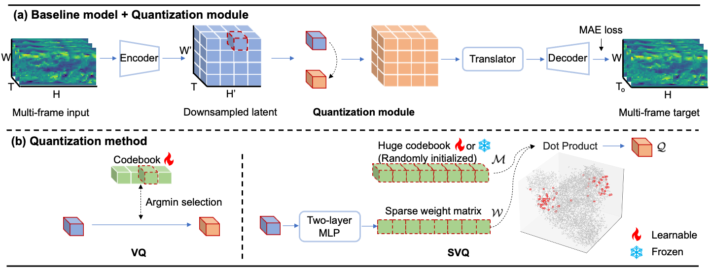

# A Differentiable Sparse Vector Quantization (SVQ) for Spatio-Temporal Forecasting

## Introduction
<p align="center">
     <br>
</p>

Spatio-temporal forecasting, pivotal in numerous fields, hinges on the delicate equilibrium between isolating nuanced patterns and sifting out noise. To tackle this, we introduce Sparse Regression-based Vector Quantization (SVQ), a novel technique that leverages sparse regression for succinct representation, an approach theoretically and practically favored over classical clustering-based vector quantization methods. This approach preserves critical details from the original vectors using a regression model while filtering out noise via sparse regularization. Moreover, we approximate the sparse regression process using a blend of a two-layer MLP and an extensive codebook. This approach not only substantially cuts down on computational costs but also grants SVQ differentiability and training simplicity, resulting in a notable enhancement of performance. Our empirical studies on five spatial-temporal benchmark datasets demonstrate that SVQ achieves state-of-the-art results. Specifically, on the WeatherBench-S temperature dataset, SVQ improves the top baseline by 7.9\%. In video prediction benchmarks—Human3.6M, KTH, and KittiCaltech—it reduces MAE by an average of 9.4\% and improves image quality by 17.3\% (LPIPS).

## Overview

This repository is developed based on [OpenSTL](https://github.com/chengtan9907/OpenSTL). We plug the proposed SVQ module in [SimVP](https://github.com/A4Bio/SimVP-Simpler-yet-Better-Video-Prediction).

* `openstl/modules/quantization_modules.py` contains implementation of SVQ and other exisitng VQ methods.
* `openstl/models/simvpvq_model.py` contains the SimVP+VQ model.
* `openstl/methods/simvpvq.py` contains core file for training and inference.

## Install

The environment can be easily reproduced using the following commands:

```
conda create -n svq python=3.10
conda activate svq
pip install torch==1.12.1+cu116 torchvision==0.13.1+cu116 torchaudio==0.12.1 --extra-index-url https://download.pytorch.org/whl/cu116
pip install -e .
pip install vector-quantize-pytorch==1.12.5 geos basemap pyproj dill==0.2.7.1 einops seaborn
```

Please refer to [OpenSTL project](https://github.com/chengtan9907/OpenSTL) to download datasets. We use WeatherBench (weather), Human3.6M (human pose), KTH (human action), KittiCaltech (driving scene), and TaxiBJ (traffic) in our paper.

## Main experiments

### WeatherBench-S Temperature

```
python tools/train.py --overwrite -d weather_t2m_5_625 --res_dir work_dirs/weather_t2m_5_625  -c configs/weather/t2m_5_625/SimVPVQ_gSTA_learnable.py
python tools/train.py --overwrite -d weather_t2m_5_625 --res_dir work_dirs/weather_t2m_5_625  -c configs/weather/t2m_5_625/SimVPVQ_gSTA_frozen.py
```

### WeatherBench-S Humidity

```
python tools/train.py --overwrite -d weather_r_5_625 --res_dir work_dirs/weather_r_5_625  -c configs/weather/r_5_625/SimVPVQ_Swin_learnable.py
python tools/train.py --overwrite -d weather_r_5_625 --res_dir work_dirs/weather_r_5_625  -c configs/weather/r_5_625/SimVPVQ_Swin_frozen.py
```

### WeatherBench-S Wind Component

```
python tools/train.py --overwrite -d weather_uv10_5_625 --res_dir work_dirs/weather_uv10_5_625  -c configs/weather/uv10_5_625/SimVPVQ_Swin_learnable.py
python tools/train.py --overwrite -d weather_uv10_5_625 --res_dir work_dirs/weather_uv10_5_625  -c configs/weather/uv10_5_625/SimVPVQ_Swin_frozen.py
```

### WeatherBench-S Total Cloud Cover

```
python tools/train.py --overwrite -d weather_tcc_5_625 --res_dir work_dirs/weather_tcc_5_625  -c configs/weather/tcc_5_625/SimVPVQ_gSTA_learnable.py
python tools/train.py --overwrite -d weather_tcc_5_625 --res_dir work_dirs/weather_tcc_5_625  -c configs/weather/tcc_5_625/SimVPVQ_gSTA_frozen.py
```

### WeatherBench-M

```
python tools/train.py --overwrite -d weather_mv_4_4_s6_5_625 --res_dir work_dirs/weather_mv_4_s6_5_625  -c configs/weather/mv_4_s6_5_625/SimVPVQ_MogaNet_learnable.py
python tools/train.py --overwrite -d weather_mv_4_4_s6_5_625 --res_dir work_dirs/weather_mv_4_s6_5_625  -c configs/weather/mv_4_s6_5_625/SimVPVQ_MogaNet_frozen.py
```

### WeatherBench-HMV

```
PORT=29001 CUDA_VISIBLE_DEVICES=0,1 bash tools/dist_train.sh configs/weather/hmv_4_s6_5_625/SimVPVQ_gSTA_learnable.py 2 -d weather_hmv_4_4_s6_5_625 --res_dir work_dirs/weather_hmv_4_4_s6_5_625 --ex_name SimVPVQ_gSTA_learnable
PORT=29001 CUDA_VISIBLE_DEVICES=0,1 bash tools/dist_train.sh configs/weather/hmv_4_s6_5_625/SimVPVQ_gSTA_frozen.py 2 -d weather_hmv_4_4_s6_5_625 --res_dir work_dirs/weather_hmv_4_4_s6_5_625 --ex_name SimVPVQ_gSTA_frozen
PORT=29001 CUDA_VISIBLE_DEVICES=0,1 bash tools/dist_train.sh configs/weather/hmv_4_s6_5_625/SimVP_gSTA.py 2 -d weather_hmv_4_4_s6_5_625 --res_dir work_dirs/weather_hmv_4_4_s6_5_625 --ex_name SimVP_gSTA
```

### KTH

```
PORT=29001 CUDA_VISIBLE_DEVICES=0,1,2,3 bash tools/dist_train.sh configs/kth/simvp/SimVPVQ_IncepU_learnable.py 4 -d kth --res_dir work_dirs/kth
PORT=29001 CUDA_VISIBLE_DEVICES=0,1,2,3 bash tools/dist_train.sh configs/kth/simvp/SimVPVQ_IncepU_frozen.py 4 -d kth --res_dir work_dirs/kth
```

### KittiCaltech

```
PORT=29001 CUDA_VISIBLE_DEVICES=0,1,2,3 bash tools/dist_train.sh configs/kitticaltech/simvp/SimVPVQ_gSTA_learnable.py 4 -d kitticaltech --res_dir work_dirs/kitticaltech
PORT=29001 CUDA_VISIBLE_DEVICES=0,1,2,3 bash tools/dist_train.sh configs/kitticaltech/simvp/SimVPVQ_gSTA_frozen.py 4 -d kitticaltech --res_dir work_dirs/kitticaltech
```

### Human3.6M

```
PORT=29001 CUDA_VISIBLE_DEVICES=0,1,2,3 bash tools/dist_train.sh configs/human/simvp/SimVPVQ_gSTA_frozen.py 4 -d human --res_dir work_dirs/human
PORT=29001 CUDA_VISIBLE_DEVICES=0,1,2,3 bash tools/dist_train.sh configs/human/simvp/SimVPVQ_gSTA_learnable.py 4 -d human --res_dir work_dirs/human
```

### TaxiBJ

```
python tools/train.py --overwrite -d taxibj --res_dir work_dirs/taxibj -c configs/taxibj/simvp/SimVPVQ_gSTA_learnable.py
python tools/train.py --overwrite -d taxibj --res_dir work_dirs/taxibj -c configs/taxibj/simvp/SimVPVQ_gSTA_frozen.py

```

## Boosting performance as a versatile plug-in (MetaFormers)

```
python tools/train.py --overwrite -d weather_t2m_5_625 --res_dir work_dirs/weather_t2m_5_625  -c configs/weather/t2m_5_625/ablation_modeltype/SimVPVQ_ConvMixer.py
python tools/train.py --overwrite -d weather_t2m_5_625 --res_dir work_dirs/weather_t2m_5_625  -c configs/weather/t2m_5_625/ablation_modeltype/SimVPVQ_ConvNeXt.py
python tools/train.py --overwrite -d weather_t2m_5_625 --res_dir work_dirs/weather_t2m_5_625  -c configs/weather/t2m_5_625/ablation_modeltype/SimVPVQ_HorNet.py
python tools/train.py --overwrite -d weather_t2m_5_625 --res_dir work_dirs/weather_t2m_5_625  -c configs/weather/t2m_5_625/ablation_modeltype/SimVPVQ_IncepU.py
python tools/train.py --overwrite -d weather_t2m_5_625 --res_dir work_dirs/weather_t2m_5_625  -c configs/weather/t2m_5_625/ablation_modeltype/SimVPVQ_MLPMixer.py
python tools/train.py --overwrite -d weather_t2m_5_625 --res_dir work_dirs/weather_t2m_5_625  -c configs/weather/t2m_5_625/ablation_modeltype/SimVPVQ_MogaNet.py
python tools/train.py --overwrite -d weather_t2m_5_625 --res_dir work_dirs/weather_t2m_5_625  -c configs/weather/t2m_5_625/ablation_modeltype/SimVPVQ_Poolformer.py
python tools/train.py --overwrite -d weather_t2m_5_625 --res_dir work_dirs/weather_t2m_5_625  -c configs/weather/t2m_5_625/ablation_modeltype/SimVPVQ_Swin.py
python tools/train.py --overwrite -d weather_t2m_5_625 --res_dir work_dirs/weather_t2m_5_625  -c configs/weather/t2m_5_625/ablation_modeltype/SimVPVQ_Uniformer.py
python tools/train.py --overwrite -d weather_t2m_5_625 --res_dir work_dirs/weather_t2m_5_625  -c configs/weather/t2m_5_625/ablation_modeltype/SimVPVQ_MogaNet.py
python tools/train.py --overwrite -d weather_t2m_5_625 --res_dir work_dirs/weather_t2m_5_625  -c configs/weather/t2m_5_625/ablation_modeltype/SimVPVQ_VAN.py
python tools/train.py --overwrite -d weather_t2m_5_625 --res_dir work_dirs/weather_t2m_5_625  -c configs/weather/t2m_5_625/ablation_modeltype/SimVPVQ_ViT.py
```

## Noise injection

```
python tools/train.py --overwrite -d weather_t2m_5_625 --res_dir work_dirs/weather_t2m_5_625  -c configs/weather/t2m_5_625/ablation_noise/SVQ-0.1.py
python tools/train.py --overwrite -d weather_t2m_5_625 --res_dir work_dirs/weather_t2m_5_625  -c configs/weather/t2m_5_625/ablation_noise/raw-0.1.py --ex_name SimVP-noises0.1
```

## Comparison of VQ methods

```
python tools/train.py --overwrite -d weather_t2m_5_625 --res_dir work_dirs/weather_t2m_5_625  -c configs/weather/t2m_5_625/ablation_vq/GroupedResidualVQ.py
python tools/train.py --overwrite -d weather_t2m_5_625 --res_dir work_dirs/weather_t2m_5_625  -c configs/weather/t2m_5_625/ablation_vq/LFQ.py
python tools/train.py --overwrite -d weather_t2m_5_625 --res_dir work_dirs/weather_t2m_5_625  -c configs/weather/t2m_5_625/ablation_vq/MultiHeadVQ.py
python tools/train.py --overwrite -d weather_t2m_5_625 --res_dir work_dirs/weather_t2m_5_625  -c configs/weather/t2m_5_625/ablation_vq/ResidualFSQ.py
python tools/train.py --overwrite -d weather_t2m_5_625 --res_dir work_dirs/weather_t2m_5_625  -c configs/weather/t2m_5_625/ablation_vq/ResidualLFQ.py
python tools/train.py --overwrite -d weather_t2m_5_625 --res_dir work_dirs/weather_t2m_5_625  -c configs/weather/t2m_5_625/ablation_vq/ResidualVQ.py
python tools/train.py --overwrite -d weather_t2m_5_625 --res_dir work_dirs/weather_t2m_5_625  -c configs/weather/t2m_5_625/ablation_vq/VQ.py
```

## Ablation

```
python tools/train.py --overwrite -d weather_t2m_5_625 --res_dir work_dirs/weather_t2m_5_625  -c configs/weather/t2m_5_625/ablation_appendix/freeze_projection.py
python tools/train.py --overwrite -d weather_t2m_5_625 --res_dir work_dirs/weather_t2m_5_625  -c configs/weather/t2m_5_625/ablation_appendix/freeze_both.py
python tools/train.py --overwrite -d weather_t2m_5_625 --res_dir work_dirs/weather_t2m_5_625  -c configs/weather/t2m_5_625/ablation_appendix/SimVPVQ_gSTA_learnable_postvq.py
```


## Acknowledgement

We highly appreciate the following GitHub repositories for their invaluable code base or datasets:

https://github.com/chengtan9907/OpenSTL

https://github.com/A4Bio/SimVP-Simpler-yet-Better-Video-Prediction

https://github.com/lucidrains/vector-quantize-pytorch